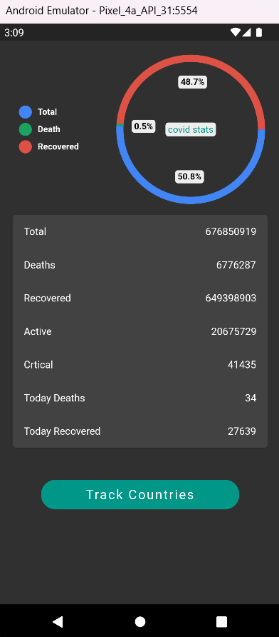
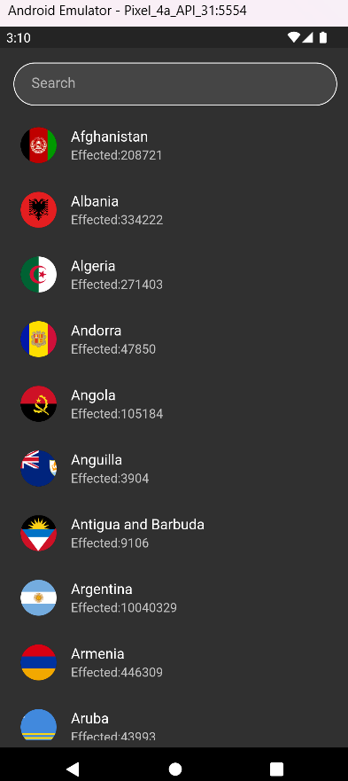
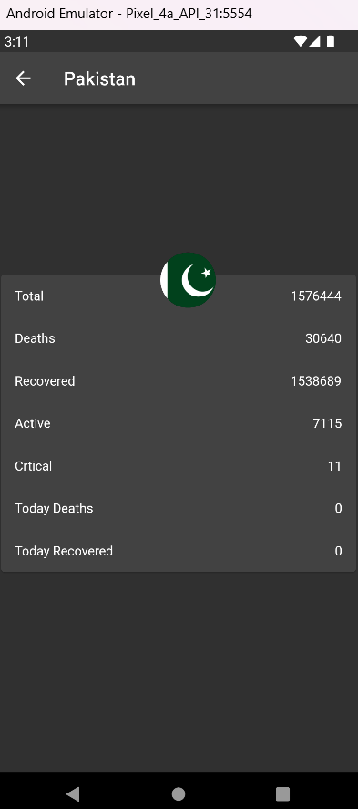

# Covid19_tracker_app

A simple Covid Tracker is an app made with Flutter framework to provide worldwide information related to Covid-19 pandemic.

## :iphone: Features

- Global case count.
- Case, death and recovery count of each country
- Total tests and infection probability of each country
- News updates related to vaccine developement
- Info, symptoms, precautions and myths of the virus
- Setting a default country

## :camera: Screenshots

<kbd></kbd>

  

  
  
  
  

